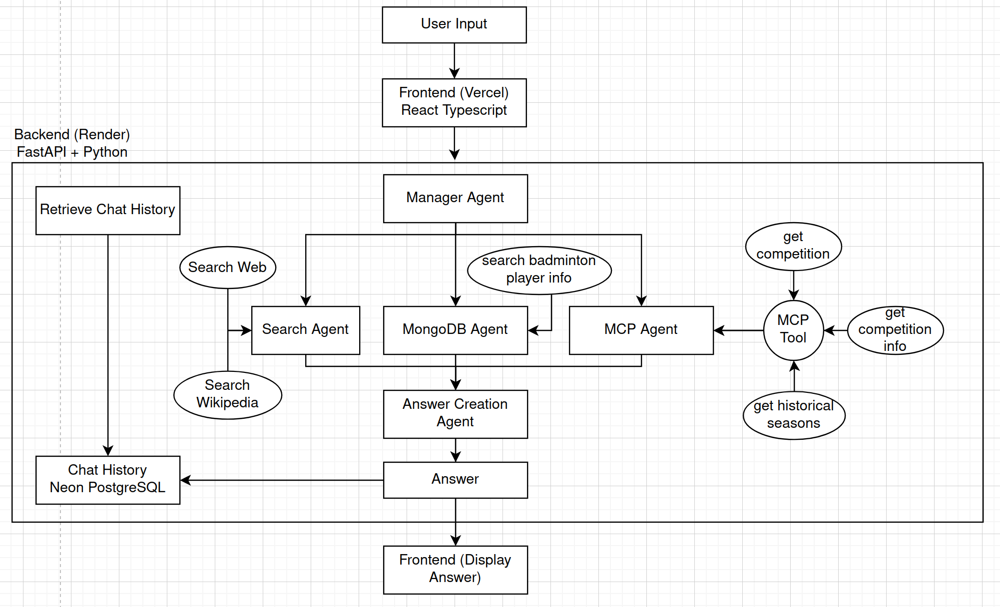
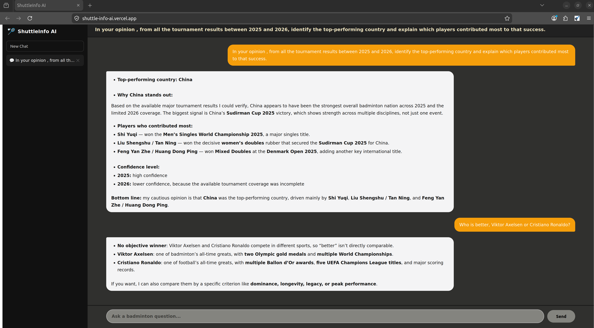

# ShuttleInfo

A multi-agent chatbot system that answers badminton-related questions. The system uses a hierarchical multi-agent architecture where multiple AI agents are assigned to specific task including retrieving information from a structured database, vector database, extracting information from external resources and provide contextual insights. The platform is implemented using FastAPI for backend services and uses OpenAI GPT models to provide understand user's question and provide good answer. This system also support chat history storage and retrieval, allowing user to continue the conversation even if close the web application. The frontend of the system is created using React with Typescript, styled with CSS and built with Vite. 

Note: When you use the web app for the first time, it will take time for to generate an answer beacuse in render, their free tier will cause the backend to sleep after 15 minutes of inactivity.
---

## ShuttleInfo AI Multi Agent System Architecture 


### Deployment
- PostgreSQL and pgvector are hosted on Neon
- Backend is hosted on Render
- Frontend is hosted on Vercel

### Agents Task:
- Manager Agent: Understands the user's question and decides which agent(s) to call
- Database Agent: Retrieves structured badminton player's name, country, height, birth date, highest ranking) from PostgreSQL and unstructured information (biography, career and achievements) from a pgvector vector database 
- MCP Agent: Retrieves badminton competition and tournament data via Sportradar API using the Model Context Protocol (MCP)
- Search Web Agent: Searches Wikipedia and the web for general badminton knowledge such as rules, techniques, and equipment
- Answer Creation Agent: Takes all collected information and formats it into a structured response for the user

### Flow:
- User enter a question
- Vercel frontend → makes API calls to Render backend
- Backend talks to Neon PostgreSQL for chat history storage
- Backend invokes the Manager Agent which fans out to 4 sub-agents
- Each sub-agent calls its own external service — MongoDB, Sportradar, or Tavily/Wikipedia
- The Answer agent collects everything and writes the final response, store the answer in the chat history storage and display it back to the frontend

## Setup
### Setting up Backend
Python version 3.12 (backend) and [Node.js](https://nodejs.org/en/download) 24.14.1(nvm with npm) (frontend) were used for this project

```bash
git clone https://github.com/yezhen-commits/Badminton_Multi_Agent_Repo.git
cd Badminton_Multi_Agent_Repo
```

Create a virtual environment and install the dependencies. 
```bash
python3.12 -m venv .venv
source .venv/bin/activate  # On Windows: .venv\Scripts\activate
pip install -r requirements.txt
```

Make a copy of example.env
```bash
# Create .env file
cp example.env .env
```

Edit the .env file to include your api keys for the models you want to use and optionalyl langsmith for tracing
- Get OpenAI API key from [OpenAIPlatform](https://www.google.com/url?sa=t&source=web&rct=j&opi=89978449&url=https://openai.com/api/&ved=2ahUKEwik-4WF6MmTAxV-zjgGHdMMIvIQFnoECBgQAQ&usg=AOvVaw1kKUMpgi5Qz-d4ZAeuSsd1)
- Get Tavily API key from [Tavily](https://www.google.com/url?sa=t&source=web&rct=j&opi=89978449&url=https://app.tavily.com/&ved=2ahUKEwimvtTk58mTAxVGwTgGHecjBYAQFnoECB8QAQ&usg=AOvVaw13bCj-cFHhDaVYkOyAocj6)
- Get SportRadar API key from [SportRadar](https://marketplace.sportradar.com/products/652fa9d03bc9b0cb71d1cf7f) P.S the one I use is the trial version and it only last for 30 days

Go to the "script" directory and run the "store_player_badminton.ipynb" to store player information to the database

Go to the "script" directory and run the command below to test the backend (Run the command in your venv) 
```bash 
uvicorn main:app --reload --port 8000 
```  

### Setting up frontend 
Install vite if you don't have it:
```bash
npm create vite@latest
```

Open another terminal and go to the "UI" diectory and run the command below: 
```bash
npm install 
npm run dev 
``` 

A link will appear in the terminal, open it to have access to view the frontend  

--- 

## Example run:


