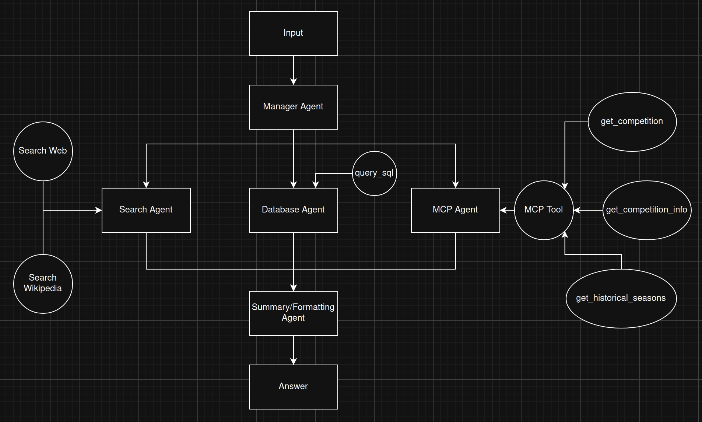

# ShuttleAI

A multi-agent system chatbot that answers all badminton related question. This is project is done for fun and as a practice for what I learned about AI Agents. 
---

## Multi Agent System Architecture 


## Setup
### Setting up Backend
Python version 3.12 is used for this project

```bash
git clone https://github.com/yezhen-commits/Badminton_Multi_Agent_Repo.git
cd Badminton_Multi_Agent_Repo
```

Make a copy of example.env
```bash
# Create .env file
cp example.env .env
```

Edit the .env filw to include your api keys for the models you want to use and optionalyl langsmith for tracing
- Get OpenAI API key from [OpenAIPlatform](https://www.google.com/url?sa=t&source=web&rct=j&opi=89978449&url=https://openai.com/api/&ved=2ahUKEwik-4WF6MmTAxV-zjgGHdMMIvIQFnoECBgQAQ&usg=AOvVaw1kKUMpgi5Qz-d4ZAeuSsd1)
- Get Tavily API key from [Tavily](https://www.google.com/url?sa=t&source=web&rct=j&opi=89978449&url=https://app.tavily.com/&ved=2ahUKEwimvtTk58mTAxVGwTgGHecjBYAQFnoECB8QAQ&usg=AOvVaw13bCj-cFHhDaVYkOyAocj6)
- Get SportRadar API key from [SportRadar](https://marketplace.sportradar.com/products/652fa9d03bc9b0cb71d1cf7f) P.S the one I use is the trial version and it only last for 30 days

Create a virtual environment and install the dependencies. 
```bash
python3.12 -m venv .venv
source .venv/bin/activate  # On Windows: .venv\Scripts\activate
pip install -r requirements.txt
```
Go to the "script" directory and run the command below to test the backend (Run the command in your venv) 
```bash 
uvicorn main:app --reload --port 8000 
```  

### Setting up frontend 
Open another terminal and go to the "UI" diectory and run the command below: 
```bash
npm install 
npm run dev 
``` 

A link will appear in the terminal, open it to have access to view the frontend  

--- 
## Changes that will be implement 
- SQL server will be replaced with a Vector Database for RAG system. The vector database will contain all the player information.

